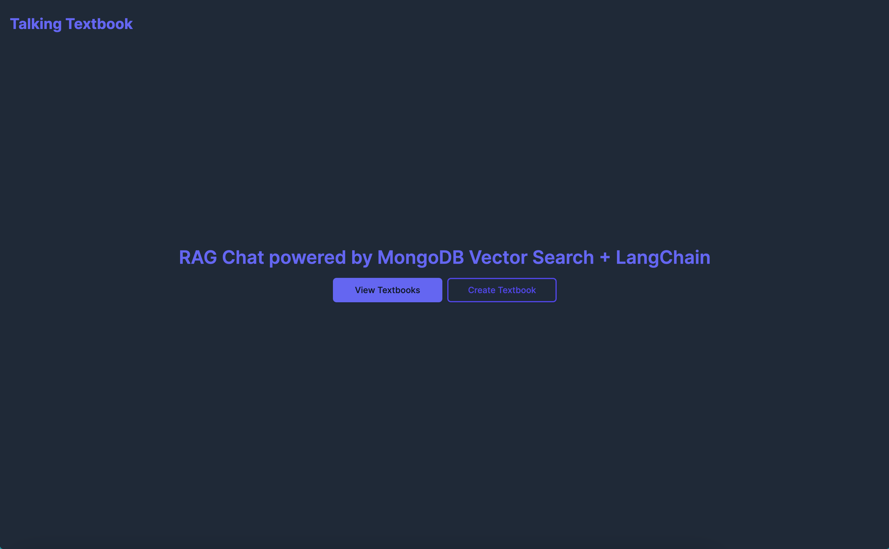
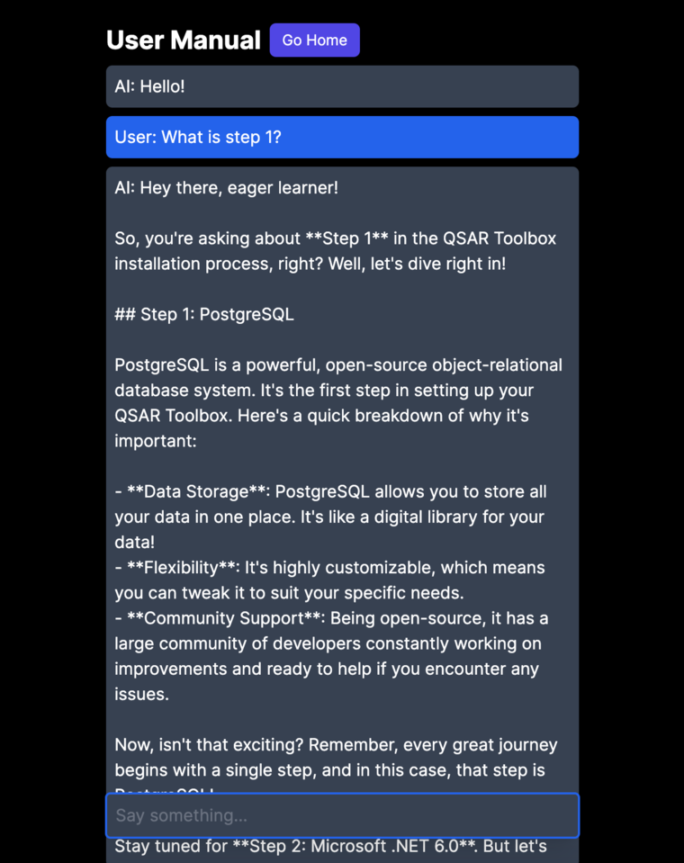
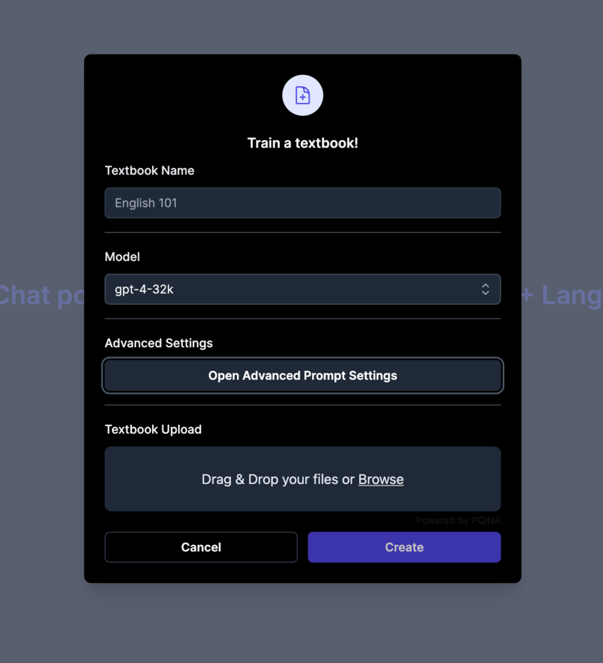
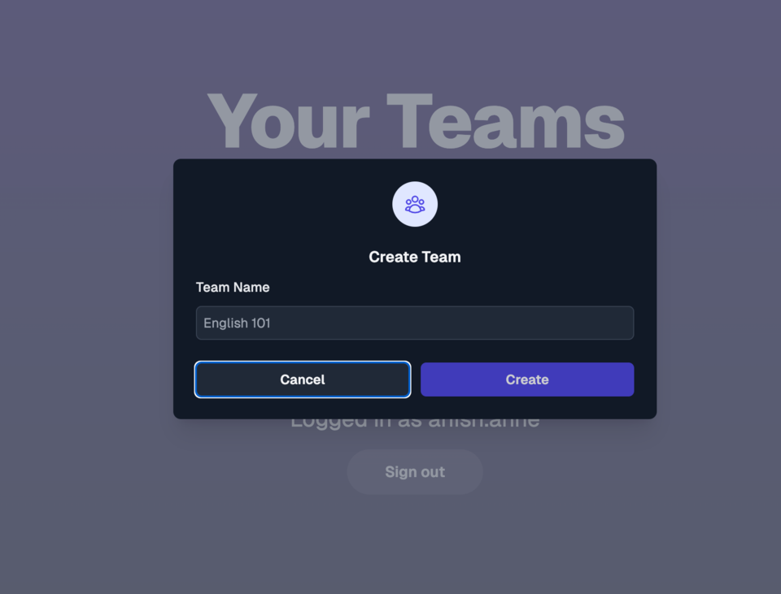

# TalkingTextbook

A self-hostable platform to create learning focused chatbots based on textbooks.









## Setting up MongoDB Vector Search

You must use MongoDB Atlas as vector search is not supported on MongoDB Community editions.
In MongoDB Atlas, head over to the `Atlas Search` tab, select Vector Search JSON Editor, and enter the following:

```json
{
	"fields": [
		{
			"numDimensions": 1536,
			"path": "embeddings",
			"similarity": "cosine",
			"type": "vector"
		},
		{
			"path": "textbookId",
			"type": "filter"
		}
	]
}
```

The index should be named `vector_index`.

## Setting up OpenAI / Azure OpenAI

In Azure AI studio, create a project, and then a deployment for `text-embedding-ada-002` and `gpt-4-turbo`.

# General Information

This is a [Next.js](https://nextjs.org/) project bootstrapped with [`create-next-app`](https://github.com/vercel/next.js/tree/canary/packages/create-next-app).

## Getting Started

First, run the development server:

```bash
npm run dev
# or
yarn dev
# or
pnpm dev
# or
bun dev
```

Open [http://localhost:3000](http://localhost:3000) with your browser to see the result!
